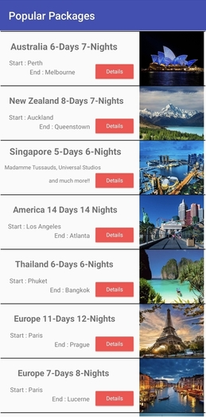
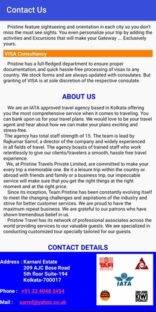
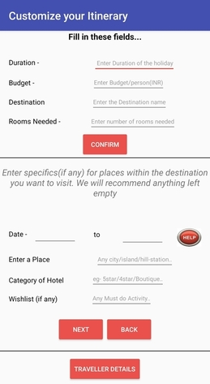
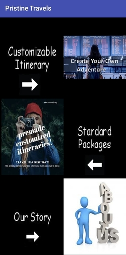

# TravelEasy - Android App

Pristine Travels Private Limited - An IATA-approved mid sized travel-agency based in Kolkata, in addition to being active members of TAAI, TAFI, and certified Aussie and Kiwi Specialists. This app is meant to establish communication with new clients in essence serving as a gateway to future endeavors together. Users can make their own customized itineraries, or avail one of our popular packages to different places all across the world using the application, the details of which will be intimated to us, through email

Travel easy is available as of now, only on Google Play Store.

## Features

The android app lets you:
- Look at standard packages that the company offers
- Create a customized itinerary for your travel, and send the same to the company without any hassel.
- Completely ad-free.
- Needs no special permissions on Android 6.0+.

## Screenshots

### Page displaying standard packages

   
### About Us page -

### Customizable Itinerary page -

   
### Home page -
